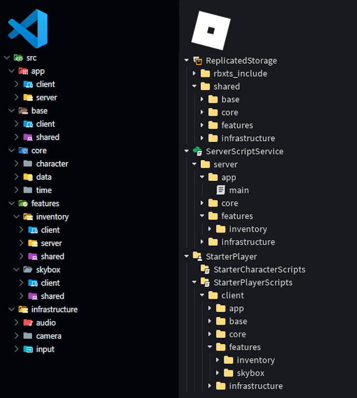

<div align="center">
	<h1>Rogen</h1>
	<p>A tool for feature-based folder structures with Rojo.</p>
	
</div>

## What is Rogen?
Rogen is a command line tool that brings **feature-based architecture** to Roblox development for both luau and roblox-ts. 

Instead of separating your codebase in a `client`, `shared` and `server` folder at the root level, Rogen lets you group your code by domain and feature. You can keep your inventory UI, inventory server script, and inventory client script all inside a single, unified `inventory` folder. This approach improves scalability, maintainability, and team collaboration.

In the background, Rogen watches your file system and dynamically generates your `default.project.json` map for Rojo, ensuring your repository stays organized by feature while Roblox receives the exact service structure it expects.

*If you use luau, it is **highly recommended** to also set up darklua for improved string requires.*

## Automatic Routing
Rogen determines a file's destination using three main strategies. Folder-based routing takes precedence over suffix-based routing.

### 1. Folder Context (Primary)
If a file is located within a folder named after a service or a keyword, it is automatically routed to that service.
* **Keywords:** `server`, `client`, `shared`
* **Services:** `ReplicatedFirst`, `ServerStorage`, `StarterGui`, etc.
* **Behavior:** All files and sub-folders within these directories inherit the target service.

### 2. Suffix Context (Secondary)
If a file is in a generic folder, Rogen inspects the filename for a suffix. This allows you to define a file's destination without moving it into a specific sub-folder.
* **Delimited Suffixes:** Use a separator such as a dot, hyphen, or underscore.
	- Examples: `auth.server.ts`, `input-client.ts`, `data_shared.ts`

* **PascalCase Suffixes:** Append the service name directly to the end of the filename.
	- Examples: `AuthServer.ts`, `InputClient.ts`, `DataShared.ts`

	**Note:** Rogen strips the suffix for the final Rojo object name. `AuthServer.ts` becomes `Auth` in Roblox.

### 3. Default
If neither matches, the file defaults to `ReplicatedStorage`.

## Setup & Integration
Integrate Rogen into your workflow to ensure that your `default.project.json` stays synchronized with your file system.

### 1. Installation
Rogen is distributed as a standalone CLI tool. Install it into your project using your preferred toolchain manager:

**Rokit (`rokit.toml`)**
```toml
[tools]
rogen = "ldgerrits/rogen@1.1.1"
```

### 2. Configuration (.rogen.json)
Create a `.rogen.json` file using `rogen --init`.

Here is a default configuration structure that works for both roblox-ts and luau, including darklua support. You may want to define a custom tree in "template" for things like adding pesde packages, mapping node_modules, or customizing specific services. If you want to map specific suffixes or folder to a particular service, use the aliases field.

```json
{
	"source": "src",
	"keepSuffixes": false,
	"luau": { 
		"output": "default.project.json", 
		"build": "src"
	},
	"ts": { 
		"output": "default.project.json", 
		"build": "out"
	},
	"darklua": { 
		"output": "build.project.json", 
		"build": "dist" 
	},
	"aliases": {
		"Controller": "ReplicatedStorage",
		"Service": "ServerScriptService"
	},
	"template": {
		"name": "roblox-project",
		"globIgnorePaths": [
			"**/package.json",
			"**/tsconfig.json"
		],
		"tree": {
			"$className": "DataModel",
			"ServerScriptService": {
				"ServerPackages": {
					"$path": "ServerPackages"
				}
			},
			"ReplicatedStorage": {
				"rbxts_include": {
					"$path": "include",
					"node_modules": { 
						"$className": "Folder", 
						"@rbxts": { 
							"$path": "node_modules/@rbxts" 
						}
					}
				},
				"Packages": {
					"$path": "Packages"
				}
			}
		}
	}
}
```

| Property            | Description                                                                                                                                                                                                                                                         |
| ------------------- | ------------------------------------------------------------------------------------------------------------------------------------------------------------------------------------------------------------------------------------------------------------------- |
| source              | The root directory where your uncompiled source code lives (defaults to "src").                                                                                                                                                                                     |
| luau / ts / darklua | Mode-specific overrides. Rogen uses these to dictate where the compiled code ends up (build) and the name of the generated Rojo file (output)                                                                                                                       |
| template            | The base Rojo tree template. Any standard Rojo `default.project.json` fields (like `name`, `globIgnorePaths`, or a custom `tree`) placed here will be safely merged with Rogen's auto-generated paths. You can also specify a path to a JSON file with a Rojo tree! |
| aliases             | An object allowing you to define custom suffix or folder routing mappings. You can use this to register new keywords (e.g., "Controller": "StarterPlayerScripts") or overwrite Rogen's default service routing behaviors.                                           |
| keepSuffixes        | A boolean flag (defaults to false). When set to true, Rogen will preserve your routing suffixes in the script names instead of stripping them out.                                                                                                                  |

### 3. CLI Usage
You can run Rogen with optional arguments to cleanly override your configurations on the fly:

- `-h, --help:` Show this help menu containing all available options.

- `-i, --init:` Generate a default .rogen.json config file.

- `-c, --config <path>`: Specify a custom Rogen config file path.

- `-m, --mode <mode>`: Specify the mode to run (luau, ts, or darklua). If omitted, Rogen automatically detects your project configuration (via tsconfig.json or .darklua.json) and runs the appropriate target(s).

- `-s, --source <path>`: Override the directory containing your raw, uncompiled code.

- `-t, --template <path>`: Specify a path to a JSON file that contains your base Rojo blueprint. If omitted, Rogen defaults to the inline object or file mapped in your .rogen.json.

- `-b, --build <path>`: Override the directory where your compiled/transpiled code lands.

- `-o, --output <path>`: Override the name and destination of the final generated Rojo .project.json file.

- `-k, --keepSuffixes`: Do not strip routing suffixes (e.g., server, client) from names.

- `-w, --watch`: Watch the source directory for changes, automatically regenerating your project files.

As an example, it is possible to pass a specific configuration file, run a custom mode, inject a base template, and force a targeted output file all at the same time:
```bash
rogen -c build.rogen.json -m darklua -t base.template.json -o build.project.json
```

### 4. Commands

#### For luau
To make Rogen run and watch your files automatically, use the following command:
```bash
rogen -w
```

#### For roblox-ts
Because there is an extra step in the compilation process, it is recommended to install `concurrently` for concurrent execution. That way, you only need to use a single command to set everything up:
```bash
npm install -D concurrently
```
Then, update your package.json script:
```json
"scripts": {
	"watch": "concurrently \"rogen -w\" \"rbxtsc -w\""
},
```
And simply run the script:
```bash
npm run watch
```
